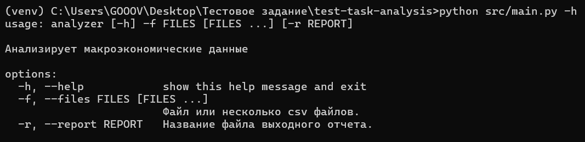
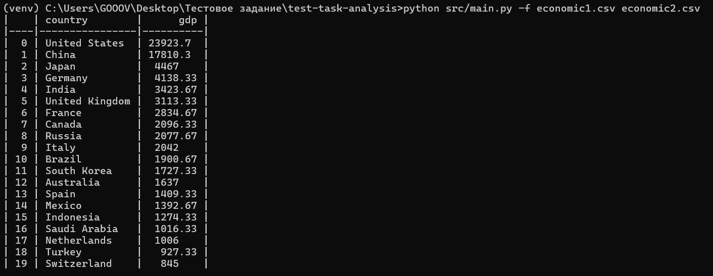
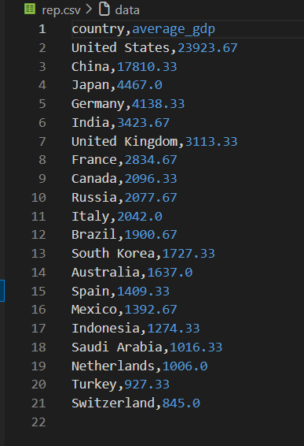

# test-task-analysis
Тестове задание анализ макроэкономических данных [ТЗ](https://docs.google.com/document/d/11ea9G2VTRJMGGV02bNKelWBTR5_wZA063yFmG4afwcc/edit?tab=t.0#heading=h.or54d8e34zbk)

## Инсталлирование

Скачать zip файл со страницы GitHub.

Либо если скачан git

```
git clone https://github.com/anime-kazakh/test-task-analysis.git
```

Запустить pip

```
pip install -r requirements.txt
```

## Использование



Во флаг -f/--files предаем файлы через пробел.



> Если не передавать значение во флаг -r/--report то результат будет выведен в консоль.

Передаём название выводного .csv файла.





